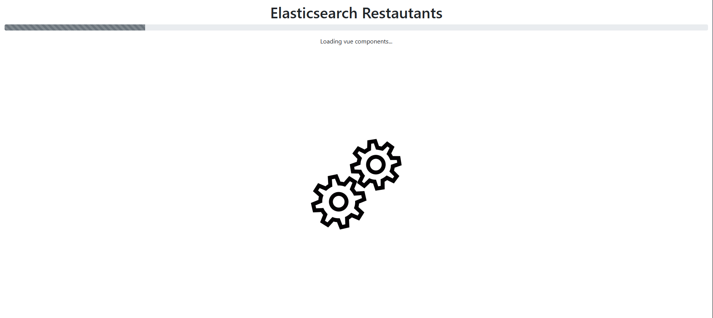
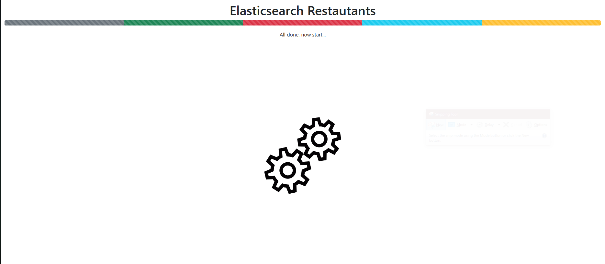
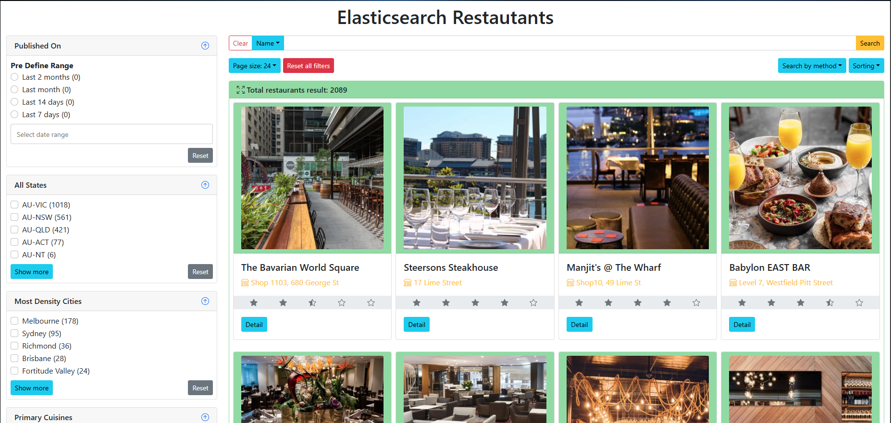
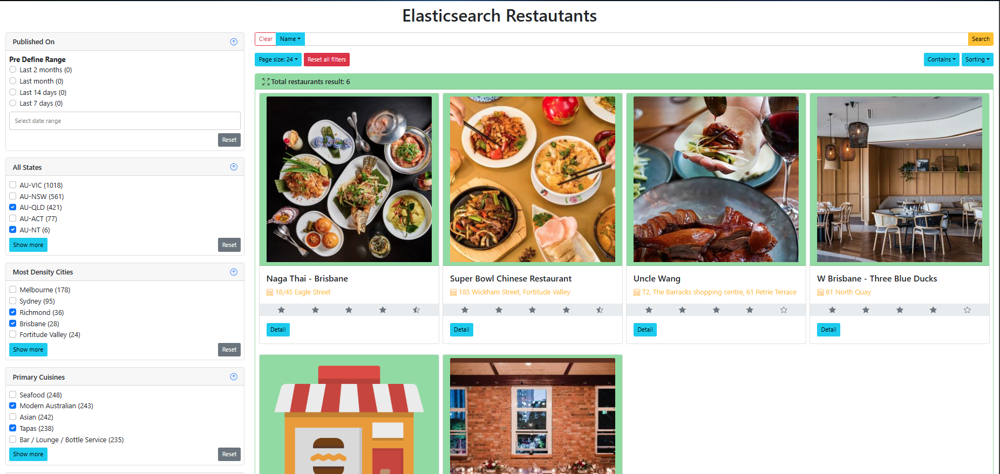
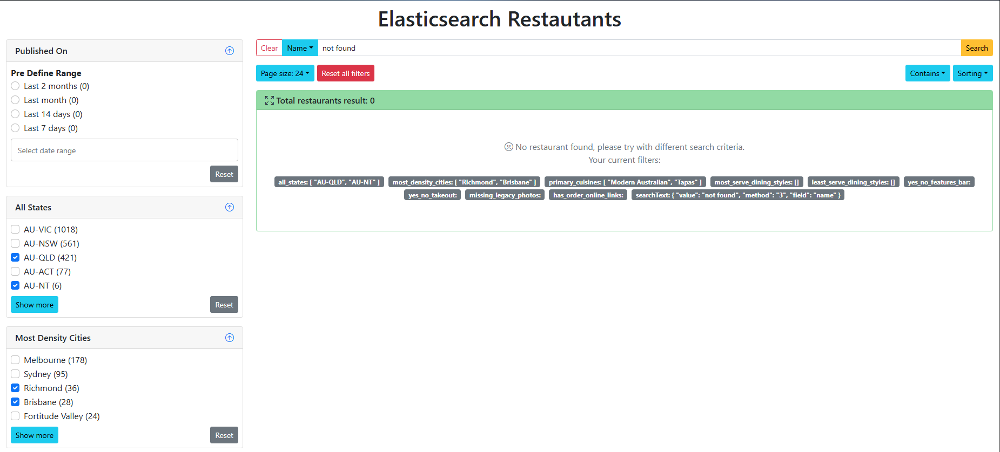
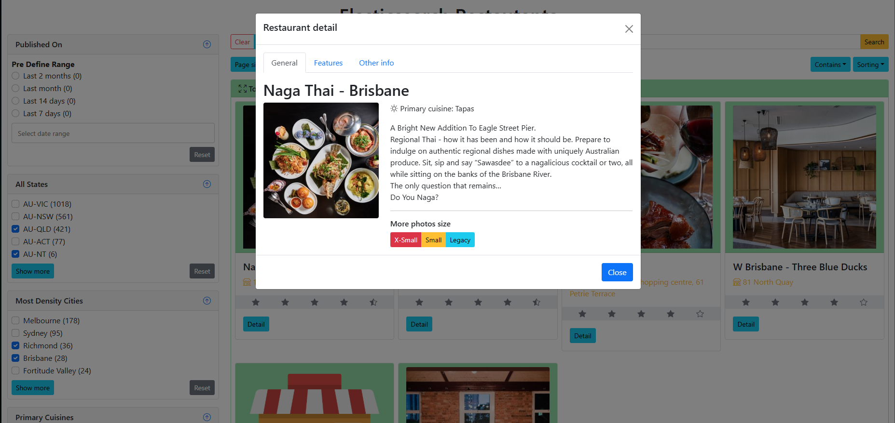
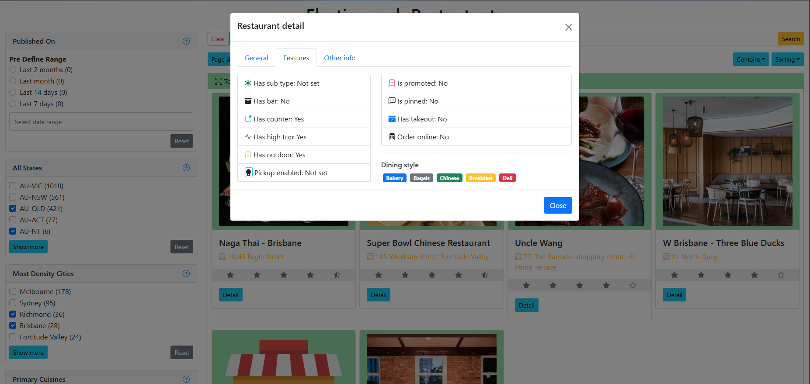
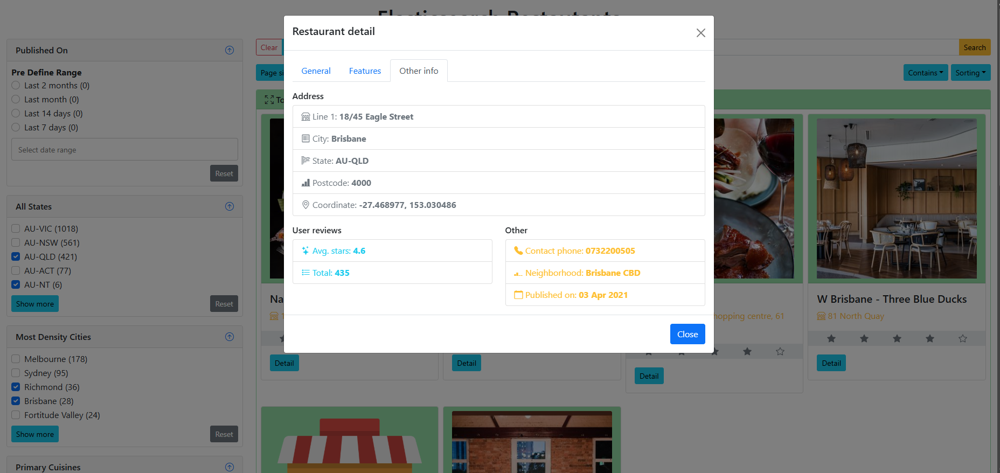

# Elasticsearch Restaurants Aggregations UI

> 🌐 Language / Ngôn ngữ: [English](readme.md) | **Tiếng Việt**

## Giới thiệu

Một ứng dụng frontend demo được xây dựng bằng **Vue 2** (không dùng build tool), minh hoạ tính năng tìm kiếm và lọc nhà hàng dựa trên Elasticsearch aggregations. Ứng dụng tải động các Vue component ngay tại trình duyệt bằng `vue3-sfc-loader`, dùng Vuex để quản lý state và BootstrapVue cho giao diện — tất cả chạy từ một file `index.html` thuần tuý, không cần bundler.

> **Backend:** Giao diện này kết nối tới API server [Elasticsearch-Restaurants-Aggregations-Api-Nodejs](https://github.com/dangkhoa2016/Elasticsearch-Restaurants-Aggregations-Api-Nodejs).

---

## Ảnh chụp màn hình

### Màn hình loading


### Hoàn tất, khởi động ứng dụng


### Kết quả tìm kiếm


### Lọc theo điều kiện


### Không tìm thấy kết quả


### Chi tiết nhà hàng — tab Tổng quan


### Chi tiết nhà hàng — tab Tính năng


### Chi tiết nhà hàng — tab Thông tin khác


---

## Công nghệ sử dụng

| Tầng | Công nghệ |
|---|---|
| UI Framework | Vue 2.7.16 |
| Quản lý state | Vuex 3.6.2 |
| Thành phần UI | BootstrapVue 2.23.1 |
| CSS framework | Bootstrap 5.1.3 ¹ |
| Chọn ngày tháng | vue-ctk-date-time-picker 2.5.0 |
| SFC loader | vue3-sfc-loader (bản vue2) 0.8.4 |
| CDN | jsDelivr (combined bundle) |
| Build tool | Không có — HTML thuần + vanilla JS |

> ¹ CSS của **Bootstrap 5.1.3** được dùng để tạo kiểu, mặc dù BootstrapVue 2 được thiết kế cho Bootstrap 4. Phần lớn markup component vẫn tương thích.

---

## Cấu trúc dự án

```
index.html                  # Entry point — nạp thư viện CDN rồi loader.js
assets/
├── app.html                # Template Vue gốc (left-panel + right-panel + modal)
├── app.js                  # Vue instance gốc + kết nối Vuex store
├── loader.js               # Loader tuần tự: stores → .vue components → app
├── helpers.js              # Các hàm tiện ích dùng chung
├── style.css               # CSS toàn cục
├── dev.json / sample.json  # Dữ liệu mock để phát triển local
stores/
├── appStore.js             # URL API endpoint + cờ showFilter
├── searchStore.js          # Query tìm kiếm, sắp xếp, phân trang, logic fetch
└── displayStore.js         # Thông tin nhà hàng đang hiển thị trong popup
components/
└── restaurant-card.js      # Component JS cho một thẻ nhà hàng
vue/
├── left-panel.vue          # Sidebar chứa tất cả các bộ lọc
├── right-panel.vue         # Lưới kết quả + phân trang + thanh tìm kiếm
├── search-top.vue          # Ô nhập văn bản tìm kiếm + chọn phương thức
├── search-result.vue       # Banner tổng số kết quả + các thẻ nhà hàng
├── filter-card.vue         # Khung bộ lọc có thể thu/mở chung
├── multiple-checkbox-filter.vue  # Bộ lọc checkbox (bang, thành phố, món ăn…)
├── boolean-radio-filter.vue      # Bộ lọc radio Yes/No/N/A (bar, takeout…)
├── has-or-missing-filter.vue     # Bộ lọc có/không có dữ liệu
├── date-range-filter.vue         # Bộ lọc khoảng thời gian
└── restaurant-modal.vue          # Popup chi tiết với 3 tab: Tổng quan/Tính năng/Khác
```

---

## Cách hoạt động

1. `index.html` tải **các thư viện CDN cốt lõi** (Vue, Vuex, vue3-sfc-loader, BootstrapVue, date picker) trong một request jsDelivr combined duy nhất.
2. Sau khi core sẵn sàng, `/assets/loader.js` được inject. Nó hiển thị **thanh tiến trình** trong khi tuần tự thực hiện:
   - Nạp các module Vuex store (`appStore`, `searchStore`, `displayStore`).
   - Nạp component JS thuần (`restaurant-card`).
   - Biên dịch và đăng ký tất cả `.vue` SFC component ở runtime thông qua `vue3-sfc-loader`.
   - Gọi API để tải dữ liệu aggregation cho bộ lọc (`GET /filters`).
3. Sau khi tải xong, Vue app chính mount vào `#app` và kích hoạt tìm kiếm đầu tiên.

---

## Cấu hình

URL API endpoint được đặt trong `stores/appStore.js`:

```js
endpoint: 'https://your-api-server-url'
```

Thay giá trị này bằng URL của instance backend API bạn đang chạy.

---

## Chạy local

Không cần bước build. Chỉ cần serve thư mục gốc bằng bất kỳ web server tĩnh nào.

```bash
# Dùng npx serve
npx serve .

# Dùng Node.js http-server
npx http-server . -p 8000

# Dùng Python
python3 -m http.server 8000

# Dùng VS Code Live Server extension
# Click chuột phải vào index.html → "Open with Live Server"
```

Sau đó mở `http://localhost:8000` trên trình duyệt.

> Đảm bảo backend API server đang chạy và `endpoint` trong `stores/appStore.js` đang trỏ đúng tới nó.

---

## Tính năng

- **Tìm kiếm toàn văn** — tìm theo tên, mô tả, số điện thoại hoặc địa chỉ với nhiều phương thức (contains, starts-with, ends-with, exact).
- **Bộ lọc checkbox đa chọn** — lọc theo bang/tiểu bang, thành phố, món ăn chính, phong cách ẩm thực (phổ biến nhất/ít phổ biến nhất).
- **Bộ lọc radio boolean** — lọc theo có bar, có takeout.
- **Bộ lọc có/không có** — lọc theo sự tồn tại của ảnh cũ hoặc link đặt online.
- **Bộ lọc khoảng thời gian** — lọc theo ngày đăng với các khoảng định sẵn hoặc chọn tuỳ chỉnh.
- **Phân trang** — kích thước trang có thể cấu hình (mặc định 24).
- **Sắp xếp** — sắp xếp kết quả theo các trường có sẵn.
- **Popup chi tiết nhà hàng** — xem đầy đủ thông tin qua 3 tab: Tổng quan, Tính năng, Thông tin khác.
